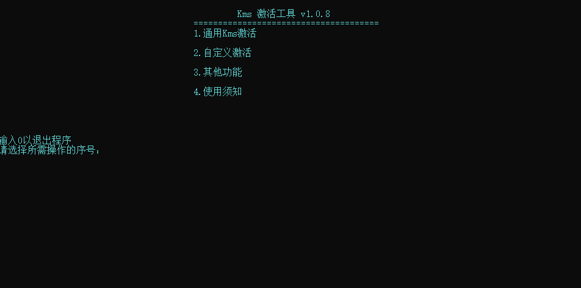

  

Kms激活

  
  
  

---

简介
---

本软件研发目的就是为了使用原生的kms指令来激活,将常用的kms命令合在一起，使用方向键和回车键来执行这些命令，如果您正好因记或找这些常用kms命令而困扰，本软件很可能会帮到你。

功能
---
* 通用激活提供一些激活服务器可供选择
* 自定义激活提供了离线Kms激活，无需联网
* 自定义激活提供了自定义Kms激活码激活(提供第三方激活服务器)
* 自定义激活提供了自定义Kms激活码激活(提供自定义激活服务器)
* 提供解除与服务器的绑定和删除激活密钥的功能
* 提供激活状态检测与详细激活信息
* 提供手动移除离线Kms激活向系统插入的dll与注册表和服务信息

下载
---

* [下载软件最新版已编译版本](https://github.com/shengjing19/Kms_Command_collection/releases) 

  

>提示：**由于使用了大量的system函数可能会被某些杀软删除，编译运行前考虑是否关闭杀毒软件。
如果选择了离线kms激活功能，其会将拷贝SECOPatcher.dll至C:\Windows\System32目录下，如果杀毒软件拦截请允许。**。

操作系统版本
---

* 系统版本要求: Win7/Win8/Win8.1/Win10及其对应的Win Server

> Win7/Win8/Win8.1及其Win10早期版本因cmd窗口的原因，可能会出现UI错位

编译以及生成
---

| 支持的编译工具：||
|:-|:-:|
| [Visual Studio](https://www.visualstudio.com/) 2022 | (推荐) |

构建步骤：

使用Debug x86
* 1.常规-平台工具集 ->C++14标准
* 2.高级-字符集 ->使用多字节字符集
* 3.C/C++->常规->SDL检测->否
* 4.C/C++->代码生成->多线程调试MTD
* 5.链接器->清单文件->UAC执行级别->requireAdministrator

使用的第三方组件
---

*第三方组件需下载编译版本或源代码自行编译，并将编译完成的放到本软件exe文件同等目录下*

- [KMSInjector](https://github.com/laomms/KMSInjector) (来自.mydigitallife的cynecx,通过HOOK的方式本机激活KMS.)
- [vlmcsd](https://github.com/Wind4/vlmcsd) (KMS Emulator in C)

许可
---

[MIT License](https://github.com/shengjing19/Kms_Command_collection/blob/master/LICENSE.txt) (free, open source)

